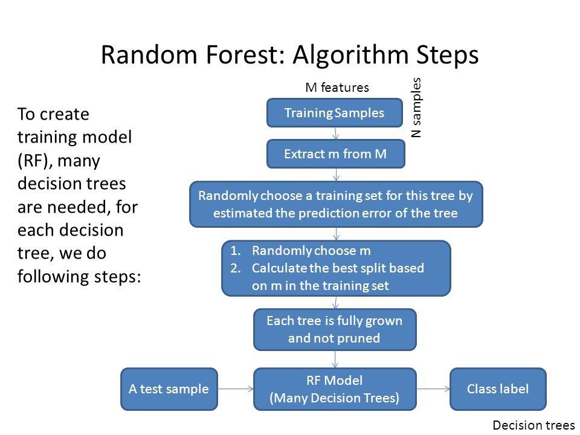

## Title
This is a repo of Decision Tree and Random Forest based Machine Learning assignments along with related datasets. It contains the basic to advanced implementation of Decision Tree and Random Forest for solving a classification problem with high efficacy.

## Dependencies to execute the notebook:
1. Python 3.6.x
2. Pip installation manager
3. Jupyter Notebook
4. Numpy
5. Pandas
6. Matplotlib
7. Seaborn

## Decision Tree Algorithm Pseudocode
1. Place the best attribute of the dataset at the root of the tree.
2. Split the training set into subsets. Subsets should be made in such a way that each subset contains data with the same value for an attribute.
3. Repeat step 1 and step 2 on each subset until you find leaf nodes in all the branches of the tree.

## Random Forest

Random forest is like bootstrapping algorithm with Decision tree (CART) model. Say, we have 1000 observation in the complete population with 10 variables. Random forest tries to build multiple CART models with different samples and different initial variables. For instance, it will take a random sample of 100 observation and 5 randomly chosen initial variables to build a CART model. It will repeat the process (say) 10 times and then make a final prediction on each observation. Final prediction is a function of each prediction. This final prediction can simply be the mean of each prediction.

## References :
1. https://medium.com/deep-math-machine-learning-ai/chapter-4-decision-trees-algorithms-b93975f7a1f1
2. https://towardsdatascience.com/decision-tree-an-algorithm-that-works-like-the-human-brain-8bc0652f1fc6
3. https://towardsdatascience.com/understanding-random-forest-58381e0602d2
4. https://towardsdatascience.com/an-implementation-and-explanation-of-the-random-forest-in-python-77bf308a9b76
5. https://www.analyticsvidhya.com/blog/2014/06/introduction-random-forest-simplified/
